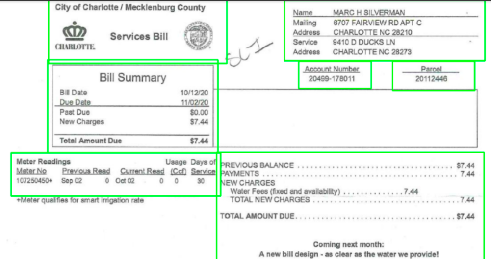
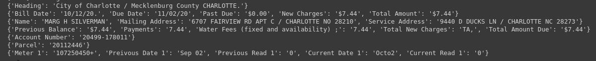

# OCR - INVOICE

Ready made optical character recognition class using python and tesseract ocr . This project consist of few stages :
* Read pdf file and convert to image files .
* Align the invoice with template invoice .
* Identify the text containing areas .
* Extract the important text content from the image .
* Using Tesseract OCR convert image exacted images to text .
* Create a CSV file with information extracted .

## Installation

Use the package manager [pip](https://pip.pypa.io/en/stable/) to install below packages .Most of the package commands for Linux platform if your'e using a windows please use appropriate commands .

```bash
sudo apt-get install libleptonica-dev 
sudo apt-get install tesseract-ocr
sudo apt-get install libtesseract-dev
pip install tesseract
pip install tesseract-ocr
pip install pytesseract
pip install pdf2image
pip install opencv
sudo apt-get install poppler-utils
```

## Usage

Run the jupyter notebook file after installation of above packages .

## Results

Text area extraction using opencv image processing methods.


Extracted Test Results 



* I have added  file have a check on my implementation .


## Contributing
Pull requests are welcome. For major changes, please open an issue first to discuss what you would like to change.

Please make sure to update tests as appropriate.

## License

Apache License 2.0